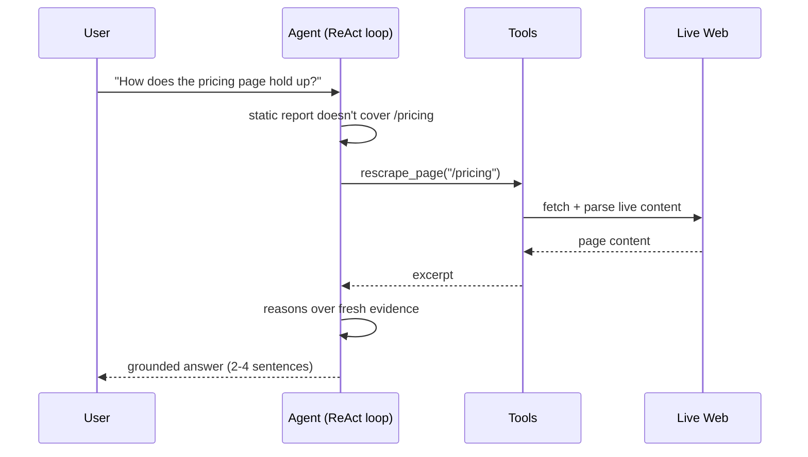
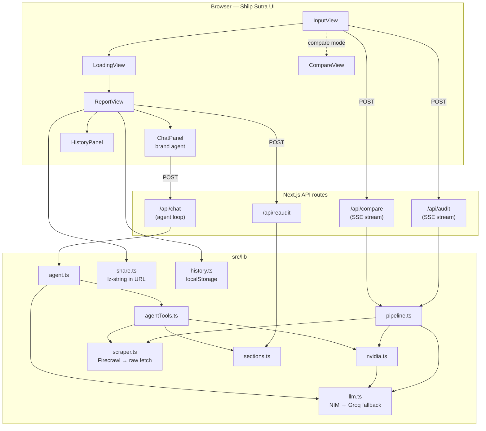

<div align="center">

<svg width="88" height="88" viewBox="0 0 40 40" fill="none" xmlns="http://www.w3.org/2000/svg">
<defs>
<linearGradient id="a" x1="0" y1="0" x2="40" y2="40" gradientUnits="userSpaceOnUse">
<stop offset="0%" stop-color="#7c3aed"/><stop offset="55%" stop-color="#4f46e5"/><stop offset="100%" stop-color="#2563eb"/>
</linearGradient>
<linearGradient id="b" x1="0" y1="0" x2="40" y2="40" gradientUnits="userSpaceOnUse">
<stop offset="0%" stop-color="#a78bfa" stop-opacity="0.35"/><stop offset="100%" stop-color="#60a5fa" stop-opacity="0.08"/>
</linearGradient>
</defs>
<path d="M20 2.5 L36 11.25 L36 28.75 L20 37.5 L4 28.75 L4 11.25 Z" fill="url(#a)"/>
<path d="M20 8 L31 14 L31 26 L20 32 L9 26 L9 14 Z" fill="url(#b)"/>
<path d="M14.5 28 L20 13 L25.5 28" stroke="white" stroke-width="2.5" stroke-linecap="round" stroke-linejoin="round" fill="none"/>
<path d="M16.8 22.5 L23.2 22.5" stroke="white" stroke-width="2.5" stroke-linecap="round"/>
<path d="M16 30 L20 33.5 L24 30" stroke="rgba(255,255,255,0.18)" stroke-width="1.5" stroke-linecap="round" fill="none"/>
</svg>

# Astitva

**Know your brand. Shape your identity.**

An AI brand-audit tool that scores any website on clarity, consistency, differentiation, and trust — then hands you a **live agent** that can go dig up more evidence on its own.

<p>


</p>

Built for the **[Build with Shilp Sutra](https://shilp-sutra.devalok.in/) Open Buildathon** — Devalok's design system, used end-to-end for UI.

</div>

---

## What it does

Paste a URL. In ~30–60 seconds you get a full brand identity audit:

- **4 scores** — Clarity, Consistency, Differentiation, Trust (0–100 each)
- **Tone & positioning** — primary voice, target audience, value proposition, market position
- **Brand claims** extracted straight from the copy
- **Strengths & weaknesses**, each with a concrete "why"
- **Prioritized recommendations** — high/medium/low, with expected impact
- **Optional visual audit** (screenshot-based) and **competitor benchmark** run automatically alongside the main analysis
- **Compare mode** — audit two brands side by side
- **Shareable, read-only report links** — state is compressed into the URL, no database
- **Local audit history** — re-run or diff against a past score
- **A brand agent**, not just a chatbot — see below

## The agentic layer

Most "AI report" tools stop at one LLM call that produces a fixed JSON blob. Astitva's chat panel is a **tool-using agent** that decides for itself when the static report isn't enough evidence, and goes and gets more:



The agent has three tools, each backed by a real network call — not canned data:

| Tool | What it actually does |
|---|---|
| `rescrape_page` | Fetches and reads another path on the audited site (e.g. `/pricing`, `/about`) that the original audit never saw |
| `analyze_competitor` | Scrapes a named competitor **live** and scores it on the same 4 dimensions, for a grounded comparison |
| `regenerate_section` | Re-runs a focused, deeper pass on one report section (tone / positioning / claims / strengths) |

The loop (`src/lib/agent.ts`) is a small ReAct implementation: the model gets `tools` + `tool_choice: auto` on every turn, decides whether to call one, the result is fed back as a `tool` message, and it repeats (capped at 3 rounds) until it answers in plain text. The UI shows exactly which tools fired, as small chips above the reply — the agent's actions are visible, not hidden.

Ask it *"vs Stripe"* or *"check the pricing page"* in the demo and watch it actually go fetch that data before answering.

## Architecture



**Audit pipeline** (`src/lib/pipeline.ts`): scrape + screenshot in parallel → NVIDIA NIM structured analysis → synthesis + visual audit + competitor benchmark in parallel, streamed to the client as Server-Sent Events so the UI can show live step progress.

**LLM orchestration** (`src/lib/llm.ts`): every call tries **NVIDIA NIM** first, falls back to **Groq** if the key is missing or the call fails — no single point of failure, no vendor lock-in. The same fallback chain now also handles tool-calling (`callLLMWithTools`) for the agent.

## Tech stack

<table>
<tr><td><b>Framework</b></td><td>Next.js 15 (App Router) · React 19 · TypeScript</td></tr>
<tr><td><b>Design system</b></td><td><a href="https://shilp-sutra.devalok.in">Shilp Sutra</a> (<code>@devalok/shilp-sutra</code>) + Tailwind 4</td></tr>
<tr><td><b>Motion</b></td><td>Framer Motion</td></tr>
<tr><td><b>LLM inference</b></td><td>NVIDIA NIM (<code>llama-3.1-70b-instruct</code>) → Groq (<code>llama-3.3-70b-versatile</code>) fallback</td></tr>
<tr><td><b>Scraping</b></td><td>Firecrawl (markdown + screenshot) with a raw-fetch/HTML-strip fallback</td></tr>
<tr><td><b>State</b></td><td>No database — reports live in the URL (lz-string) or <code>localStorage</code> (history)</td></tr>
<tr><td><b>Deploy</b></td><td>Railway (Railpack, pnpm)</td></tr>
</table>

## Project structure

<details>
<summary>Click to expand full file tree</summary>

```
src/
├── app/
│   ├── page.tsx                 # main flow: idle → loading → report / compared
│   ├── layout.tsx                # root layout, theme, toaster
│   ├── r/page.tsx                 # read-only shared-report view (/r?d=...)
│   └── api/
│       ├── audit/route.ts        # SSE: runs the full pipeline for one URL
│       ├── compare/route.ts       # SSE: runs the pipeline for two URLs in parallel
│       ├── chat/route.ts          # runs the agent loop for one chat turn
│       └── reaudit/route.ts       # re-runs one report section on demand
├── components/
│   ├── InputView.tsx              # URL input, compare toggle, demo mode
│   ├── LoadingView.tsx            # live step progress (scrape/analyze/synthesize)
│   ├── ReportView.tsx              # full report, exposes onAuditUrl for history re-runs
│   ├── CompareView.tsx             # side-by-side two-brand view
│   ├── ChatPanel.tsx               # the brand agent UI — shows tool-call trace chips
│   ├── HistoryPanel.tsx            # localStorage-backed past audits
│   ├── WhyAstitva.tsx              # comparison section on the landing view
│   ├── EcosystemSection.tsx         # Devalok product ecosystem footer
│   └── Logo.tsx
└── lib/
    ├── pipeline.ts                # orchestrates scrape → analyze → synthesize
    ├── agent.ts                   # ReAct tool-calling loop for the chat agent
    ├── agentTools.ts               # tool definitions + execution (rescrape/competitor/section)
    ├── sections.ts                 # shared section-regeneration logic (reaudit + agent tool)
    ├── llm.ts                      # NIM → Groq fallback, incl. tool-calling variant
    ├── nvidia.ts                   # structured brand-analysis prompt (NIM)
    ├── claude.ts                   # strategic synthesis pass (via llm.ts, not Anthropic)
    ├── scraper.ts                  # Firecrawl scrape/screenshot, raw-fetch fallback
    ├── share.ts                    # lz-string encode/decode for shareable report URLs
    ├── history.ts                  # localStorage audit history + score deltas
    ├── mock.ts                     # canned devalok.in report for demo mode
    └── types.ts                    # AuditReport, ScoreSet, HistoryEntry
```

</details>

## Running it locally

```bash
pnpm install
cp .env.example .env.local   # fill in at least one LLM key
pnpm dev                     # http://localhost:3000
```

You need **at least one** of `NVIDIA_API_KEY` or `GROQ_API_KEY` (both are OpenAI-compatible endpoints, tried in that order with automatic fallback). Everything else is optional:

| Variable | Required? | Effect if missing |
|---|---|---|
| `NVIDIA_API_KEY` | one of these two | falls back to Groq |
| `GROQ_API_KEY` | one of these two | falls back to NIM |
| `FIRECRAWL_API_KEY` | optional | scraping degrades to raw fetch + HTML strip; no screenshots, so the visual audit is skipped |
| `ANTHROPIC_API_KEY` | optional | visual (screenshot-based) audit pass is skipped |

No sign-up flow, no database — clone, drop in a key, run.

## Why Shilp Sutra

Every surface in this app — inputs, buttons, the compare toggle, the report cards — is built on **Shilp Sutra**, Devalok's open-source Tailwind 4 component system for React/Next.js. It's the same system this buildathon is about, used for real: `<Input>` from `@devalok/shilp-sutra/ui/input` on the very first screen the user sees, theme tokens (`--color-bg-primary`, `--color-text-secondary`, etc.) driving every color in the report, and the design-system-native dark theme end to end.

## License

MIT — built by [Devalok](https://devalok.in) for the Shilp Sutra Open Buildathon.
